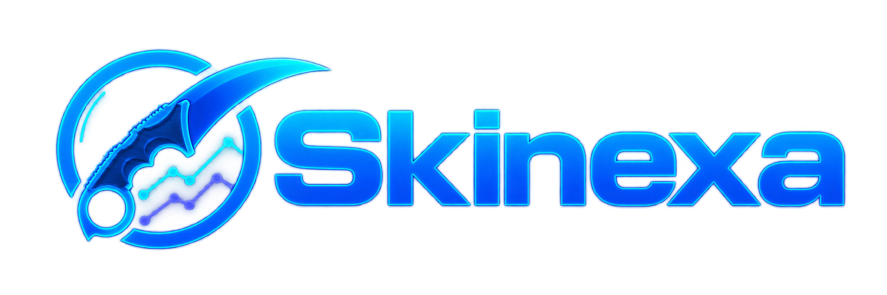

<div align="center">



---

<p>
    Plataforma web para centralização, acompanhamento e análise do mercado de itens de Counter-Strike 2.
</p>

</div>

<br>

> 🚧 **Projeto em desenvolvimento**
>
> Funcionalidades, arquitetura e documentação podem sofrer alterações até a consolidação da versão 1.0.

## 📖 Sobre o projeto

O **Skinexa** é um projeto pessoal de engenharia de software desenvolvido com o objetivo de centralizar informações relacionadas ao mercado de itens do Counter-Strike 2.

A plataforma busca reunir dados provenientes de diferentes marketplaces em uma única interface, permitindo pesquisar itens, comparar preços, acompanhar históricos e variações de valor e, futuramente, configurar alertas personalizados.

Além de solucionar um problema real enfrentado pela comunidade, o projeto tem como objetivo aplicar boas práticas de desenvolvimento de software, arquitetura, segurança, persistência de dados, testes automatizados e integração com APIs externas.

## 🎯 Problema

Atualmente, jogadores, colecionadores e interessados no mercado de itens do Counter-Strike 2 precisam acessar diferentes plataformas para:

- pesquisar itens;
- acompanhar preços;
- comparar marketplaces;
- analisar históricos de preços;
- acompanhar variações de valor;
- configurar alertas.

Essa fragmentação dificulta o acompanhamento do mercado e torna o processo pouco prático.

## 💡 Solução

O Skinexa busca centralizar essas informações em uma única plataforma.

A versão 1.0 está sendo desenvolvida para permitir que o usuário:

- pesquise itens do Counter-Strike 2;
- visualize informações detalhadas sobre cada item;
- compare preços entre diferentes marketplaces;
- consulte preços do Steam Community Market;
- acompanhe históricos e variações de preços;
- visualize gráficos e indicadores;
- configure alertas personalizados;
- favorite itens para acompanhamento.

A arquitetura foi projetada para permitir a integração progressiva de novos marketplaces, ampliando as possibilidades de comparação de preços ao longo da evolução do projeto.

## 🚀 Funcionalidades planejadas para a versão 1.0

As funcionalidades abaixo representam o escopo planejado para a primeira versão do Skinexa. O progresso atual do desenvolvimento pode ser acompanhado no [Roadmap](#️-roadmap).

### Autenticação

- Login com Steam (OpenID)
- Logout
- Identificação do usuário por meio da conta Steam

### Dashboard

- Visão geral do mercado
- Itens favoritos
- Alertas ativos
- Indicadores de preços
- Variações de mercado
- Gráficos e informações relevantes

### Pesquisa de itens

- Buscar itens do Counter-Strike 2
- Visualizar informações detalhadas
- Filtrar e ordenar resultados
- Consultar histórico de preços
- Comparar valores entre marketplaces

### Comparação de preços

- Steam Community Market
- Skinport
- CSFloat
- Arquitetura preparada para integração com novos marketplaces

### Histórico de preços

- Registro das coletas de preço
- Consulta da evolução histórica
- Variação de preços ao longo do tempo
- Visualização por meio de gráficos e indicadores

### Favoritos

- Adicionar itens aos favoritos
- Remover itens dos favoritos
- Listar itens acompanhados

### Alertas

- Alerta de preço acima de determinado valor
- Alerta de preço abaixo de determinado valor
- Monitoramento dos itens selecionados
- Notificações internas

### Perfil

- Avatar Steam
- Nome de exibição
- SteamID
- Informações públicas da conta utilizadas pela aplicação

### Configurações

- Tema
- Idioma
- Moeda
- Preferências de notificações

## 🧱 Tecnologias utilizadas

### Backend

- Python
- Flask
- SQLAlchemy
- Flask-Login
- Flask-WTF

### Frontend

- HTML5
- CSS3
- Bootstrap 5
- JavaScript

### Banco de dados

- MySQL

### Integrações

- Steam
- Skinport
- CSFloat
- Banco Central do Brasil (BCB)

### Ferramentas

- Poetry
- Pytest
- Git
- GitHub

## 🏗️ Arquitetura

O projeto utiliza uma organização modular, separando responsabilidades entre rotas, serviços, integrações externas, acesso a dados, DTOs, domínio e utilitários.

```text
Cliente (Browser)
        │
        ▼
Frontend
HTML / CSS / Bootstrap / JavaScript
        │
        ▼
Flask
Blueprints / Routes
        │
        ▼
Services
Regras e orquestração da aplicação
        │
   ┌────┴─────────────┐
   ▼                  ▼
Database          Integrations
SQLAlchemy Core       │
   │            ┌─────┴─────────────┐
   ▼            ▼         ▼         ▼
 MySQL        Steam    Skinport   CSFloat
```

Essa separação reduz o acoplamento entre as regras da aplicação, persistência e serviços externos, facilitando testes, manutenção e inclusão de novas integrações.

A aplicação também utiliza objetos de domínio e DTOs para separar os formatos recebidos de serviços externos das representações utilizadas internamente pelo Skinexa.

## 📂 Estrutura do projeto

```text
A estrutura completa do projeto será documentada após a consolidação da arquitetura da versão 1.0.
```

## 🧪 Testes

O projeto utiliza **Pytest** para testes automatizados das principais camadas da aplicação.

Atualmente, a suíte possui testes envolvendo:

- autenticação;
- tratamento de erros;
- persistência e histórico de preços;
- integrações externas;
- normalização de dados;
- comparação e consulta de preços;
- acesso a dados;
- rotas;
- services;
- funções utilitárias.

Para executar a suíte:

```bash
poetry run pytest
```

## 💻 Como rodar a aplicação localmente

> ⚠️ As instruções de execução ainda podem sofrer alterações enquanto a versão 1.0 está em desenvolvimento.

```bash
# Clonar o repositório
git clone https://github.com/ProjetosDevVviniciws/Skinexa.git

# Entrar na pasta
cd Skinexa

# Instalar as dependências
poetry install

# Executar a aplicação
poetry run python run.py
```

## 🗄️ Banco de dados

O Skinexa utiliza **MySQL** para persistência dos dados da aplicação.

O modelo de dados está sendo desenvolvido para suportar estruturas relacionadas a:

- usuários e configurações;
- plataformas de mercado;
- catálogo de itens do Counter-Strike 2;
- anúncios de marketplaces;
- acessórios associados a anúncios;
- histórico de preços;
- favoritos;
- alertas;
- notificações.

As definições do banco permanecem versionadas junto ao projeto e podem sofrer alterações durante o desenvolvimento da versão 1.0.

A documentação definitiva para configuração e inicialização do banco de dados será adicionada após a consolidação do modelo de dados.

## 🗺️ Roadmap

### Versão 1.0

- [x] Autenticação com Steam
- [x] Integração inicial com marketplaces
- [x] Estrutura de comparação de preços
- [x] Infraestrutura base do histórico de preços
- [x] Testes automatizados da base atual
- [ ] Catálogo e pesquisa de itens
- [ ] Comparação completa entre marketplaces
- [ ] Histórico e gráficos de preços
- [ ] Dashboard
- [ ] Favoritos
- [ ] Alertas
- [ ] Notificações
- [ ] Configurações
- [ ] Dockerização
- [ ] Revisão de segurança
- [ ] Testes finais
- [ ] Deploy

### Futuras versões

- [ ] Novos marketplaces
- [ ] Histórico e analytics avançados
- [ ] Dashboard avançado
- [ ] Insights de mercado
- [ ] Aplicativo mobile
- [ ] Push notifications

## 📄 Licença

Este projeto está licenciado sob a licença MIT.

Consulte o arquivo **LICENSE** para mais informações.